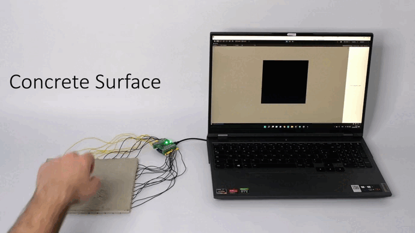
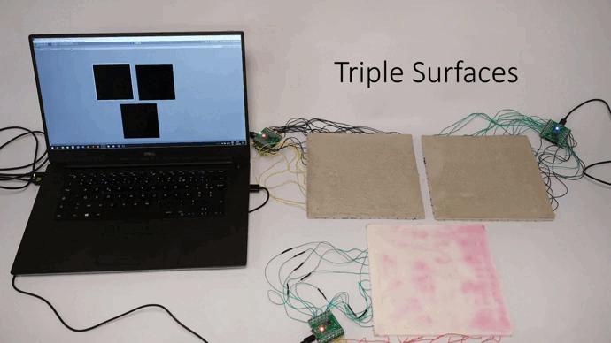

# SenSurface

Toward seamless integration of touch sensing on everyday surfaces.

## What ?

Creating scalable capacitive interfaces with everyday materials and seamless integration.

  

These examples present the SenSurface system capabilities
- Left: Concrete capacitive interface connected via USB
- middle: Wood capacitive interface with wireless connection
- Right: Multiples SenSurfaces interfaces are used together. They can be connected using USB, WiFi, or both.

The sensitive surfaces fabrication process and codes are shared in the next section:

## How ?

### Documentation

## Why ?

## Contact

## Credit